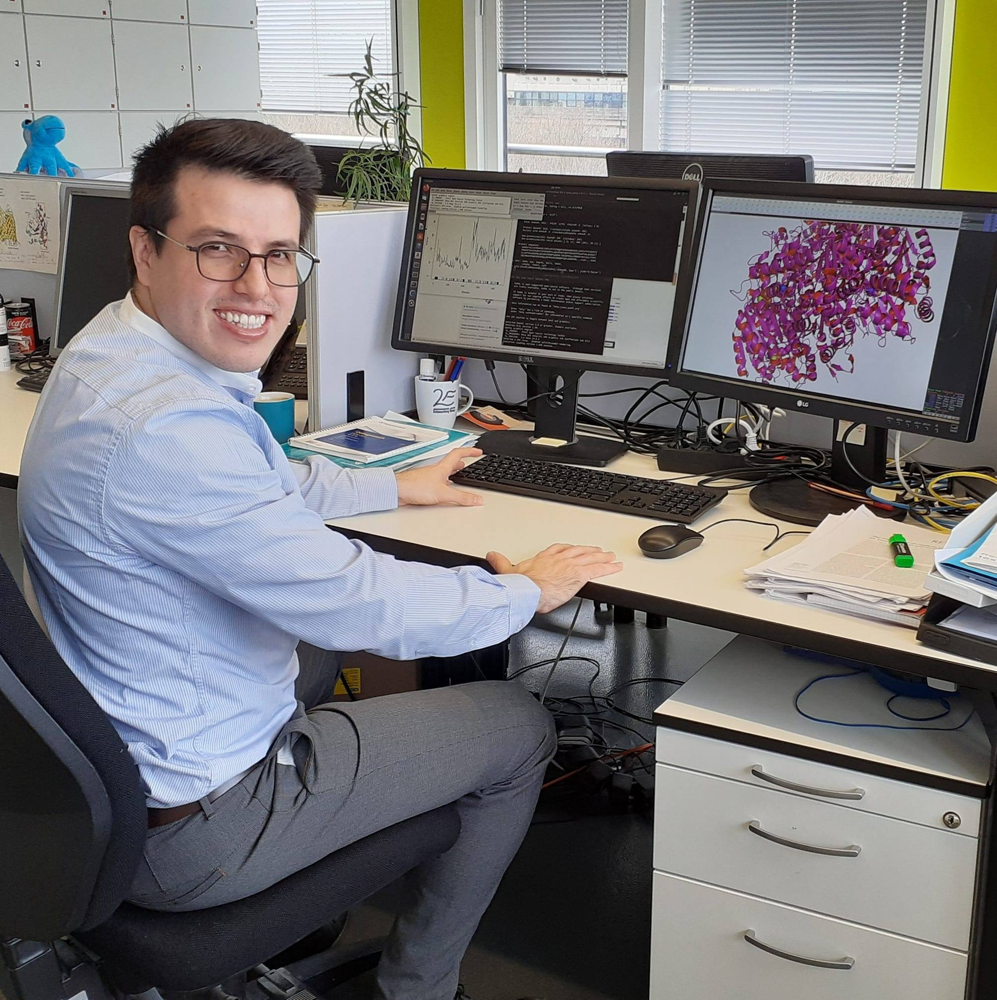

<html >
<head>
  <meta charset="UTF-8">
  <meta name="viewport" content="width=device-width, initial-scale=1.0">
  <title>Ricardo's webpage </title>
  <link href="https://fonts.googleapis.com/css?family=Ubuntu|VT323&display=swap" rel="stylesheet">
  <link rel="stylesheet" href="css/style.css">
</head>
<body>
  
  <h1>Ricardo Parra-Cruz</h1>
  <h2>About</h2>
  

I am an early career research scientist, who is passionate about industrial biotechnology, digital
transformation, and bioengineering. I have 4+ years of experience in the field of protein,
microbiology, and data science research. Besides, I have been closely involved with computational
modeling tools, bioprocesses with an emphasis on waste management and recovery, as well as,
process planning and biotech business development, which are crucial for the vaccine and pharma
industry. I have strong experience working and leading multidisciplinary teams in Australia,
Germany, South East Asia, UK, and Colombia.
  

   <h2>Skills</h2>
  
Python (basic), R, Molecular Dynamics, Gaussian, Project management Data analysis, and UNIX commands

   <h2>Codes</h2>
  
<a href="https://github.com/ricardoparra747" target="_blank">GitHub</a>

  <h2>Contact</h2>
  
<a href="https://www.linkedin.com/in/ricardo-andr%C3%A9s-parra-cruz-phd-a7265247/" target="_blank">Linkedin</a>

  
<a href="https://www.twitter.com/ricardo_parrac?lang=en/" target="_blank">Twitter</a>

  
>_

</body>
</html>
